# Point Cloud Library Reference with ROS
Author: methylDragon    
Just a reference for Point Cloud Library with some code snippets and ROS examples.   
Adapted from [the ROS wiki](http://wiki.ros.org/pcl/Overview) and [the PCL docs](http://pointclouds.org/documentation/tutorials)

---

> The **Point Cloud Library** (or **PCL**) is a **large scale, open project [1]** for 2D/3D image and point cloud processing. The PCL framework contains numerous state-of-the art algorithms including filtering, feature estimation, surface reconstruction, registration, model fitting and segmentation. These algorithms can be used, for example, to filter outliers from noisy data, stitch 3D point clouds together, segment relevant parts of a scene, extract keypoints and compute descriptors to recognize objects in the world based on their geometric appearance, and create surfaces from point clouds and visualize them -- to name a few.
>
> PCL is released under the terms of the [3-clause BSD license](http://en.wikipedia.org/wiki/BSD_licenses#3-clause_license_.28.22New_BSD_License.22_or_.22Modified_BSD_License.22.29) and is open source software. **It is free for commercial and research use.**
>
> PCL is **cross-platform**, and has been successfully compiled and deployed on Linux, MacOS, Windows, and [Android/iOS](http://pointclouds.org/news/2012/05/29/pcl-goes-mobile-with-ves-and-kiwi/). To simplify development, PCL is split into a series of smaller code libraries, that can be compiled separately. This modularity is important for distributing PCL on platforms with reduced computational or size constraints (for more information about each module see the [documentation](http://pointclouds.org/documentation/) page).
>
> <http://pointclouds.org/about/>


## Preface

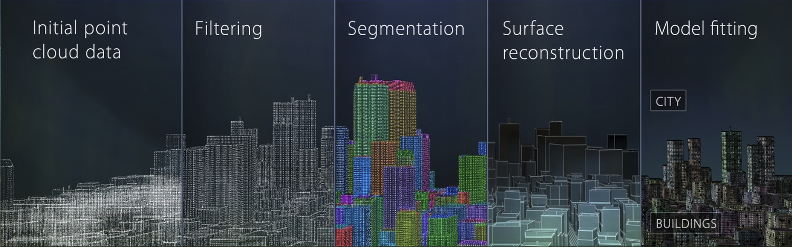

[Image Source](<http://pointclouds.org/>)

This tutorial will only cover use of PCL within the ROS framework, and so will only include compilation and installation instructions for a ROS related setup, and **not** standalone use.

Though there are many interesting Python wrappers for the library, we will only be covering the C++ library since it allows for easier integration with the MoveIt! C++ API, which is more complete than the MoveIt! Python API.

Also, this tutorial will not be exhaustive, as there's really too much to cover. But it should be more than enough to give enough of a working knowledge of the PCL library.

For more information, check the [docs](<http://docs.pointclouds.org/trunk>) or the [official tutorials](<http://pointclouds.org/documentation/tutorials)!


### Pre-Requisites

This tutorial presumes a working knowledge of ROS, C++, and some standard computer vision related algorithms like SIFT or RANSAC.

ROS Melodic (or above) has to be [installed](<http://wiki.ros.org/ROS/Installation>), which should install PCL by default within the `pcl_ros` package.

But failing that, you may install PCL for your respective ROS distribution, together with the PCL command line tools as follows.

```shell
# Eg. For Melodic
sudo apt install ros-melodic-pcl-ros
sudo apt install pcl-tools
```

Additionally, you may choose to create a ROS workspace to use the example packages listed in the tutorial directory to follow along.


### Minimal Projects

You should be able to find some nice starter projects in this tutorial's directory. They're especially helpful for CMake configuration, and finding out what libraries to import.

> **If you want to run the test examples, remember to copy paste them into a ROS workspace and build the workspace!**


## Table Of Contents <a name="top"></a>

1. [Introduction](#1)    
   1.1. [Point Clouds](#1.1)    
   1.2. [Point Cloud Library Overview](#1.2)    
   1.3. [PCL Module Dependency Tree](#1.3)    
2. [PCL Tools](#2)    
   2.1. [View Point Clouds](#2.1)    
   2.2. [Converting Files](#2.2)    
   2.3. [Filtering](#2.3)    
3. [PCL and ROS](#3)    
   3.1. [Data Types](#3.1)    
   3.2. [Visualising Pointclouds in RViz](#3.2)    
   3.3. [pcl_ros Nodes](#3.3)    
   3.4. [pcl_ros Nodelets](#3.4)    
   3.5. [Octomaps](#3.5)    
4. [PCL C++ API](#4)    
   4.1. [Introduction](#4.1)    
   4.2. [ROS Package Setup](#4.2)    
   4.3. [Basic Includes](#4.3)    
   4.4. [Point Clouds](#4.4)    
   4.5. [Accessing Point Cloud Points](#4.5)    
   4.6. [Common Field Names](#4.6)    
   4.7. [PCL and ROS Point Cloud Conversions](#4.7)    
   4.8. [File IO](#4.8)    
   4.9. [Cloud Concatenation](#4.9)    
   4.10. [Filters](#4.10)    
   4.11. [Visualisation](#4.11)    
5. [Putting It Together: Cylinder Segmentation Example Integration with MoveIt!](#5)    
   5.1. [Includes and Definitions](#5.1)    
   5.2. [Class Definition](#5.2)    
   5.3. [Private and Protected Members](#5.3)    
   5.4. [Class Methods](#5.4)    
   5.5. [Main Function](#5.5)    


## 1. Introduction <a name="1"></a>

### 1.1. Point Clouds <a name="1.1"></a>
[go to top](#top)


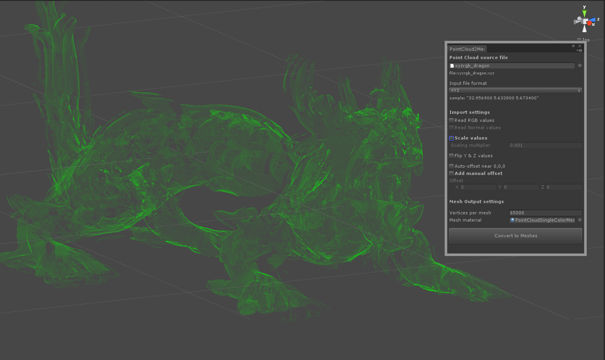

![[resize output image]](assets/ezgif-3-0b2b7a5b11ed.gif)

Point clouds are a "cloud" of n-dimensional points (usually 3D). It's literally a vector of points that exist in (usually) 3D space!

If each point in a point cloud is **p**, then **p** can contain:

- **Position**: XYZ, etc.
- **Colour**: RGB, etc
- **Intensity**: Distances
- **Segmentation tags**

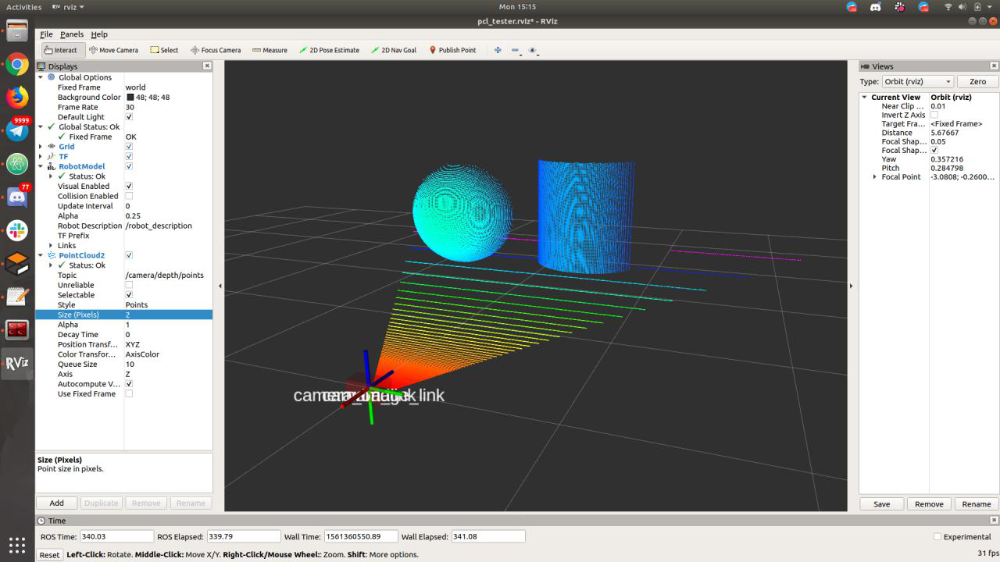

You can get point cloud data from sensors, and you can interact with and visualise using either PCL, or the Robot Operating System (ROS) framework!

You can get point clouds from:

- Laser scans
  - 3D LiDARs
  - 2D LiDARs
    - For 2D point clouds
    - For 3D point clouds, you can move the lidar around and aggregate the scans using a laser assembler
- Stereo cameras (via disparity)
- ToF/IR cameras (like RGB-D cameras)
- Simulations

These are useful for:

- Navigation
- Grasping
- Object recognition
- and much, much more!


### 1.2. Point Cloud Library Overview <a name="1.2"></a>
[go to top](#top)


Here are some of the modules. Though this **isn't all of them.**

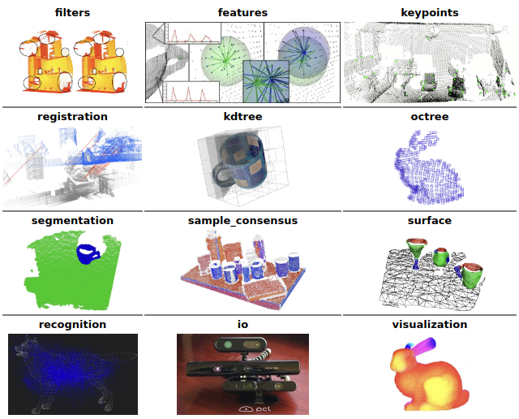

[Image Source](<http://pointclouds.org/documentation/tutorials/walkthrough.php>)

PCL contains a bunch of separate libraries for various operations and utilities dealing with point clouds.

|                            Module                            |                           Summary                            | Information                                                  |
| :----------------------------------------------------------: | :----------------------------------------------------------: | :----------------------------------------------------------- |
| [**common**](http://docs.pointclouds.org/trunk/group__common.html) |                       Core PCL library                       | PointCloud and Point type classes and structs that all other modules depend on |
| [**features**](http://docs.pointclouds.org/trunk/group__features.html) |                     Getting 3D features                      | Normals and curvatures, boundary points, moment invariants, principal curvatures, point feature histograms, etc. Data from data! |
| [**filters**](http://docs.pointclouds.org/trunk/group__filters.html) |                  For filtering point clouds                  | Downsampling, outlier removal, data cleaning, index slicing, projection, etc. |
| [**geometry**](http://docs.pointclouds.org/trunk/group__geometry.html) |           Geometry data structures and algorithms            | Faces, lines, vertices, meshes, and lots of other cool stuff! |
|  [**io**](http://docs.pointclouds.org/trunk/group__io.html)  | Read and write to and from point cloud data (PCD files), or stream data from sensors | Sensor buffers, file handlers for many, many different formats. |
| [**kdtree**](http://docs.pointclouds.org/trunk/group__kdtree.html) | Space-partitioning data structure (better for 2D or static)  | Uses FLANN to partition data for nearest-neighbour search optimisation. Data structure for efficiency. |
| [**keypoints**](http://docs.pointclouds.org/trunk/group__keypoints.html) |                   Cloud keypoint detection                   | NARF, SIFT, SUSAN and Trajkovic corner detectors. Find interest points based off of detected features. |
| [**octree**](http://docs.pointclouds.org/trunk/group__octree.html) |        Space-partitioning (better for 3D or dynamic)         | Efficient nearest-neighbour within voxel, K-nearest neighbour, radius based nearest neighbour, and more! Data structure for efficiency. |
| [**outofcore**](http://docs.pointclouds.org/trunk/group__outofcore.html) |  For clouds that are too large to be stored in main memory   | Special outofcore octree data structure for working with large point clouds. |
| [**recognition**](http://docs.pointclouds.org/trunk/group__recognition.html) | Consensus algorithms for matching custom and generic models (objects) to clouds! | Find the centre of a general model within a cloud, recognise objects within a cloud with 3D descriptor matching, get the 6DOF pose of a model in a cloud. |
| [**registration**](http://docs.pointclouds.org/trunk/group__registration.html) |            Cloud alignment/distance minimisation             | ICP, ELCH, etc. Match and align several point clouds.        |
| [**sample_consensus**](http://docs.pointclouds.org/trunk/group__sample__consensus.html) |  Consensus algorithms for matching basic models to clouds!   | Algorithms like RANSAC, and model definitions for basic shapes and planes. |
| [**search**](http://docs.pointclouds.org/trunk/group__search.html) |           Search algorithms for nearest neighbours           | Implements nearest neighbour search algorithms for various data structures like the KD-Tree, or Octree. |
| [**segmentation**](http://docs.pointclouds.org/trunk/group__segmentation.html) |    Segment point clouds into distinct objects or clusters    | Find planes, cylinders, euclidean clusters, etc. Split a point cloud into semantically meaningful sub-clouds! |
| [**surface**](http://docs.pointclouds.org/trunk/group__surface.html) |            Mesh reconstruction, surface smoothing            | Create meshes out of point clouds through simple trianglulation, or find convex or concave hulls, or smooth surfaces! |
| [**visualization**](http://docs.pointclouds.org/trunk/group__visualization.html) |                   GUI and Visualisations!                    | Render and set visual properties for clouds, draw shapes, get histograms, show normals, and more! |


### 1.3. PCL Module Dependency Tree <a name="1.3"></a>
[go to top](#top)


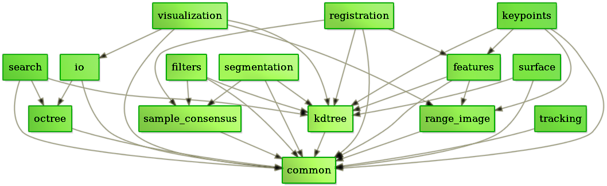

[Image Source](<http://pointclouds.org/about/>)


## 2. PCL Tools <a name="2"></a>

PCL comes with a bunch of handy binaries that can be run from the command line! You can look at all 160+ of them by typing `pcl_` and pressing tab twice on a UNIX computer, but here's a rundown of the more useful ones.

```shell
# Installing PCL tools
sudo apt install pcl-tools
```

> If you need help or want to use the advanced commands, feel free to type `<command> -h`!


### 2.1. View Point Clouds <a name="2.1"></a>
[go to top](#top)


You can head over to `models/dragon` to try this out on the `dragon_sparse.pcd` file there!

**PCL Viewer**:

![[resize output image]](assets/ezgif-3-0b2b7a5b11ed.gif)

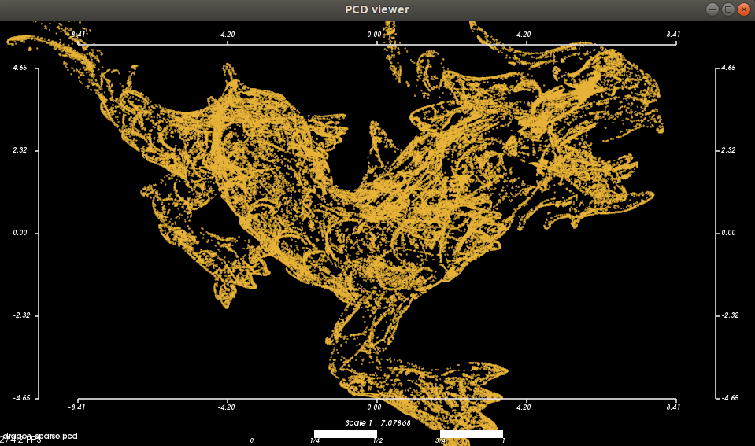

**Octree Viewer**:

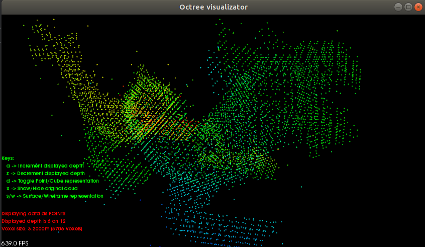

```shell
# PCL Viewer
$ pcl_viewer <source_pcd>
$ pcl_viewer dragon_sparse.pcd


# PCL Octree Viewer ('Compresses' model, then shows it)
$ pcl_octree_viewer <source_pcd> <resolution>
$ pcl_viewer dragon_sparse.pcd 0.05
```

### 2.2. Converting Files <a name="2.2"></a>
[go to top](#top)


```shell
# And relatives, just press tab and check them out!
$ pcl_ply2pcd

# Generic converter between OBJ, PCD, PLY, STL and VTK formats
$ pcl_converter <source> <dest>
```

### 2.3. Filtering <a name="2.3"></a>
[go to top](#top)


```shell
# Voxel Filter
$ pcl_voxel_filter -leaf [SIZE_X, SIZE_Y, SIZE_Z] <source> <dest>

# Outlier Removal
$ pcl_outlier_removal -radius 0.1 -min_pts 1 <source> <dest>
```


## 3. PCL and ROS <a name="3"></a>

PCL started out as a library for ROS, but eventually split off to become its own thing. But the good thing about this is that ROS still has very high support for PCL! **So much so that, for basic stuff, you don't even have to go to the library level to use PCL.**

The way ROS does it, is mostly with nodelets (that is, 'nodes' running within the same process, to allow for message transfer to not go through the TCP network, and instead be passed as a shared pointer for speed. The caveat is that messages should not be modified after they are published since it's only the pointer that got passed.) But it has a couple of nodes as well.

And of course, since ROS wraps the PCL functionality, you'll be able to interact with and transfer point clouds as messages between nodes/nodelets, as well as visualise them on RViz!

**Most of that functionality comes from the pcl_ros and associated packages!**

> **Nodes vs Nodelets**
>
> 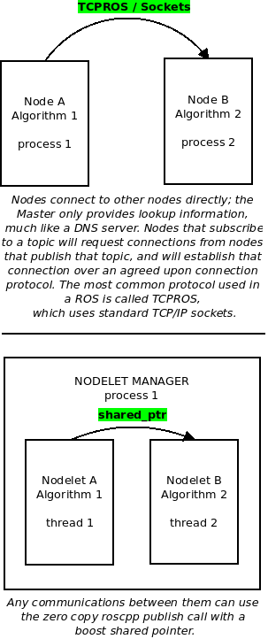
>
> Source: <http://answers.ros.org/question/230972/what-is-a-nodelet/>


### 3.1. Data Types <a name="3.1"></a>
[go to top](#top)


The main data structure used in ROS to represent point clouds is the [**sensor_msgs::PointCloud2**](<http://docs.ros.org/melodic/api/sensor_msgs/html/msg/PointCloud2.html>) message. This is the de-facto standard for use with PCL. Version 1 was never released. **Do note that this has been depreciated in favour of pcl::PCLPointCloud2** (after ROS Hydro, after PCL split from ROS and became its own independent library.)

There will still be backwards compatibility but the way forward for use with ROS should be PCLPointCloud2 (though many tutorials still use sensor_msgs::PointCloud2.)

> - [sensor_msgs::PointCloud2](http://docs.ros.org/api/sensor_msgs/html/msg/PointCloud2.html)
>   - The newly revised ROS point cloud message (and currently the *de facto* standard in **PCL**), now representing arbitrary n-D (n dimensional) data. Point values can now be of any primitive data types (int, float, double, etc), and the message can be specified as 'dense', with height and width values, giving the data a 2D structure, e.g. to correspond to an image of the same region in space. For more information on the rationale behind the new structure, see: [PCL_March_2010.pdf](http://www.ros.org/wiki/pcl?action=AttachFile&do=get&target=PCL_March_2010.pdf) and [pcl_icra2010.pdf](http://rbrusu.com/wp-content/uploads/2010/05/pcl_icra2010.pdf)

Internally, PCL uses [**pcl::PointCloud**](http://docs.pointclouds.org/trunk/classpcl_1_1_point_cloud.html), which can take in any arbitrary PointT data type structs. How to actually use it will be explored in the PCL C++ API section.

> - [pcl::PointCloud](http://docs.pointclouds.org/trunk/classpcl_1_1_point_cloud.html)
>   - The core point cloud class in the PCL library; can be templated on any of the Point types listed in [point_types.h](http://docs.pointclouds.org/trunk/point__types_8h_source.html) or a user-defined type. This class has a similar structure to the PointCloud2 message type, including a header. Converting between the message class and the point cloud template class is straightforward (see below), and most methods in the PCL library accept objects of both types. Still, it's better to work with this template class in your point cloud processing node, rather than with the message object, among other reasons because you can work with the individual points as objects rather than having to work with their raw data.
>
> Source: <http://wiki.ros.org/pcl/Overview>

And as mentioned before, **pcl::PCLPointCloud2**, which is almost if not completely identical to **sensor_msgs::PointCloud2**.


### 3.2. Visualising Pointclouds in RViz <a name="3.2"></a>
[go to top](#top)


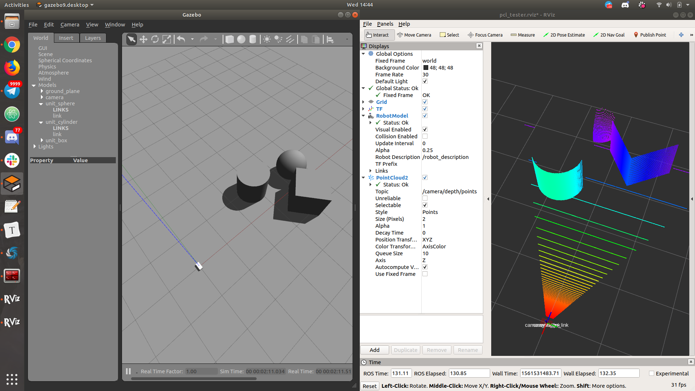

RViz visualises topic data, including `sensor_msgs/PointCloud2` data!

The following commands starts a Gazebo world. **Do place objects in front of the camera to see how the point cloud is visualised in RViz.**

> Static transforms need to be defined to set at least some sort of reference point for RViz. This is already done. 
>
> Additionally, another static transform is made between the camera and image links, because PCL's transform convention results in the image being rotated by 90 degrees in two axes.
>
> 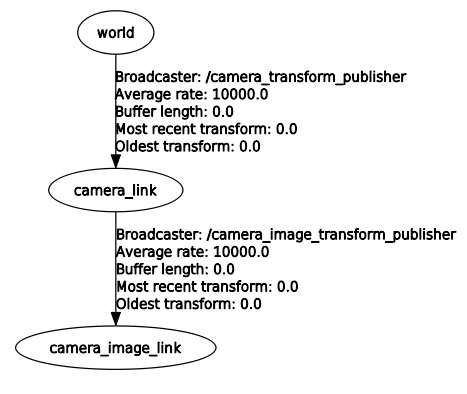

```shell
# This command should start a Gazebo simulation with a configured RViz window
$ roslaunch pcl_tester pcl_tester.launch
```


### 3.3. pcl_ros Nodes <a name="3.3"></a>
[go to top](#top)


Docs: <http://wiki.ros.org/pcl_ros>

| Node                            | Description                                                  |
| ------------------------------- | ------------------------------------------------------------ |
| **bag_to_pcd**                  | Save point clouds in bag file as PCD                         |
| **convert_pcd_to_image**        | Load PCD and publish as `sensor_msgs/Image`                  |
| **convert_pointcloud_to_image** | Subscribe to `sensor_msgs/PointCloud2` and publish as `sensor_msgs/Image` |
| **pcd_to_pointcloud**           | Load PCD and publish as `sensor_msgs/PointCloud2`<br />Note: Remember to specify `interval` to keep publishing! |
| **pointcloud_to_pcd**           | Subscribe to `sensor_msgs/PointCloud2` and save as PCD       |


### 3.4. pcl_ros Nodelets <a name="3.4"></a>
[go to top](#top)


pcl_ros comes with a set of nodelet plugins that can be used to run as operations in a dataflow.

This saves a lot of coding time if you just need to do some processing on pointclouds! Since you can work in the launch XML as opposed to all the way down to the PCL C++ API.

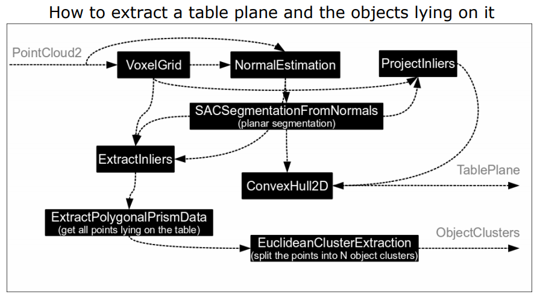

[Image source](<http://ais.informatik.uni-freiburg.de/teaching/ws10/robotics2/pdfs/rob2-12-ros-pcl.pdf>)


#### **Nodelet Operation Refresher**

| Nodelet Launch Arg                    | Description                                                  |
| ------------------------------------- | ------------------------------------------------------------ |
| load \<pkg\>/\<type\> <manager_name\> | Launch a nodelet on the nodelet manager named <manager_name> |
| standalone \<pkg\>/\<type\>           | Launch a nodelet in a standalone node                        |
| unload <nodelet_name> <manager_name>  | Unload a nodelet named <nodelet_name> on the nodelet manager named <manager_name> |
| manager                               | Launch a nodelet manager node                                |

> The nodelet names are defined by the `name=""` attribute in the `<node>` tag in the launch XML.


#### **Starting Nodelets**

**Example:**

```xml
<launch>
  <!-- Start a nodelet manager -->
  <node pkg="nodelet" type="nodelet" name="pcl_manager" args="manager" output="screen" />

  <!-- Run a VoxelGrid filter to clean NaNs and downsample the data -->
  <node pkg="nodelet" type="nodelet" name="voxel_grid" args="load pcl/VoxelGrid pcl_manager" output="screen">
    <remap from="~input" to="/camera/depth/points" />
    <rosparam>
      filter_field_name: z
      filter_limit_min: 0.01
      filter_limit_max: 1.5
      filter_limit_negative: False
      leaf_size: 0.01
    </rosparam>
  </node>
</launch>
```

Yes. It's that simple! You literally just start a node and remap the inputs and outputs, then configure the parameters accordingly.


#### **Configuring Nodelets**

If you're unsure of what parameters are available, or you wish to tune them live, you can run `rqt_reconfigure` to see and tweak the parameters!

```shell
$ rosrun rqt_reconfigure rqt_reconfigure
```

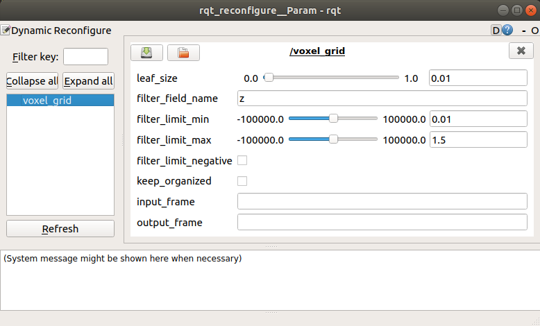

> Unfortunately not all arguments will be displayed this way, and the specific documentation for each plugin is missing...
>
> It should approximate the C++ API though. And failing that, there's always Google and the error messages if required parameters are missing. Do check the output of your terminal when messing around with these!
>
> **Most likely you will have to look through the source code:**
>
> Eg: [SACSegmentation Source](<http://docs.ros.org/latest/api/pcl_ros/html/sac__segmentation_8cpp_source.html>)
>
> From that source, we can see that there is an axis parameter that is supposed to be of size 3. So we can tell that there is an `axis` parameter that should be set as `axis: [x,y,z]`
>
> ```c++
>    pnh_->getParam ("axis", axis_param);
>    Eigen::Vector3f axis = Eigen::Vector3f::Zero ();
>  
>    switch (axis_param.getType ())
>    {
>      case XmlRpc::XmlRpcValue::TypeArray:
>      {
>        if (axis_param.size () != 3)
>        {
>          NODELET_ERROR ("[%s::onInit] Parameter 'axis' given but with a different number of values (%d) than required (3)!", getName ().c_str (), axis_param.size ());
> .
> .
> .
> ```


#### **A Note on Lazy Nodelets**

All the PCL nodelets are of type `LazyNodelet`, which means that they will not process any data unless they are subscribed to. So please ensure that you subscribe to them!


#### **PCL Nodelets**

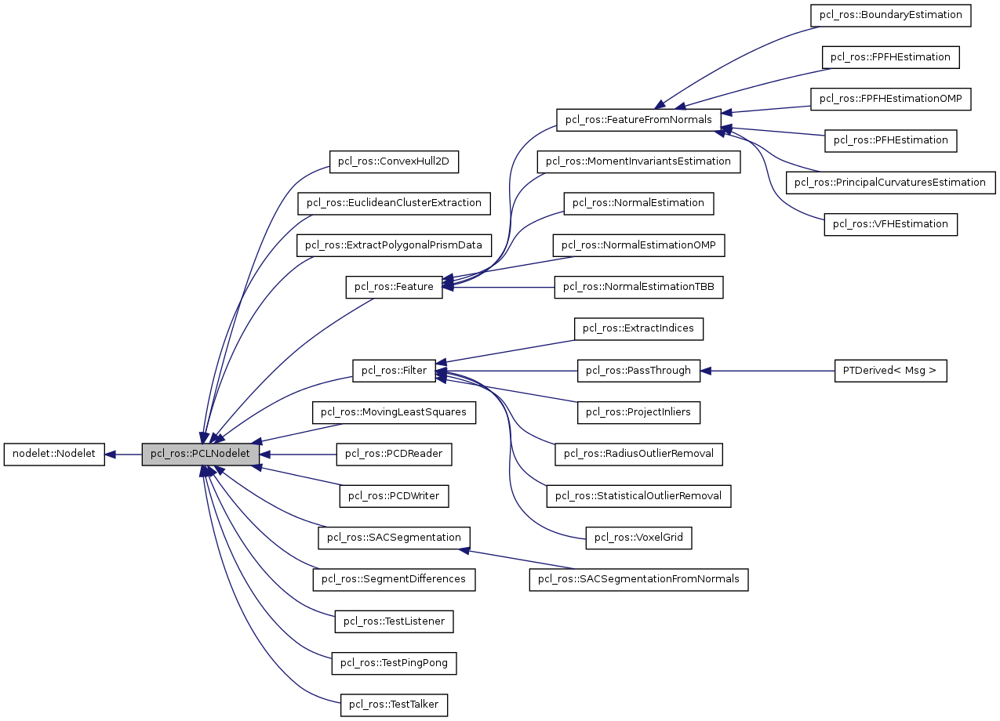

[Image Source](<http://docs.ros.org/fuerte/api/pcl_ros/html/classpcl__ros_1_1PCLNodelet.html>)

You should be able to check them out in the xml files in `/opt/ros/$(ROS_DISTRO)/share/pcl_ros/plugins/nodelet` by default.

There's also a couple of samples in `/opt/ros/$(ROS_DISTRO)/share/pcl_ros/samples/pcl_ros`

But failing that, here's the entire list:

| Features                          | Filters                       | IO                                          |
| :-------------------------------- | :---------------------------- | :------------------------------------------ |
| pcl/BoundaryEstimation            | pcl/PassThrough               | pcl/NodeletMUX                              |
| pcl/FPFHEstimation                | pcl/VoxelGrid                 | pcl/NodeletDEMUX                            |
| pcl/FPFHEstimationOMP             | pcl/ProjectInliers            | pcl/PCDReader                               |
| pcl/SHOTEstimation                | pcl/ExtractIndices            | pcl/BAGReader                               |
| pcl/SHOTEstimationOMP             | pcl/StatisticalOutlierRemoval | pcl/PCDWriter                               |
| pcl/MomentInvariantsEstimation    | pcl/RadiusOutlierRemoval      | pcl/PointCloudConcatenateFieldsSynchronizer |
| pcl/NormalEstimationOMP           | pcl/CropBox                   | pcl/PointCloudConcatenateDataSynchronizer   |
| pcl/NormalEstimationTBB           |                               |                                             |
| pcl/NormalEstimation              |                               |                                             |
| pcl/PFHEstimation                 |                               |                                             |
| pcl/PrincipalCurvaturesEstimation |                               |                                             |
| pcl/VFHEstimation                 |                               |                                             |

| Segmentation                   | Surface                |
| :----------------------------- | :--------------------- |
| pcl/ExtractPolygonalPrismData  | pcl/MovingLeastSquares |
| pcl/EuclideanClusterExtraction | pcl/ConvexHull2D       |
| pcl/SACSegmentationFromNormals |                        |
| pcl/SACSegmentation            |                        |
| pcl/SegmentDifferences         |                        |


#### **Example: VoxelGrid Filtering**

Voxel grids downsample data for easier and faster processing by other nodelets downstream!

You can see the output in the example as white dots.

> The output for voxel_grid is the name of the nodelet: `voxel_grid/output`

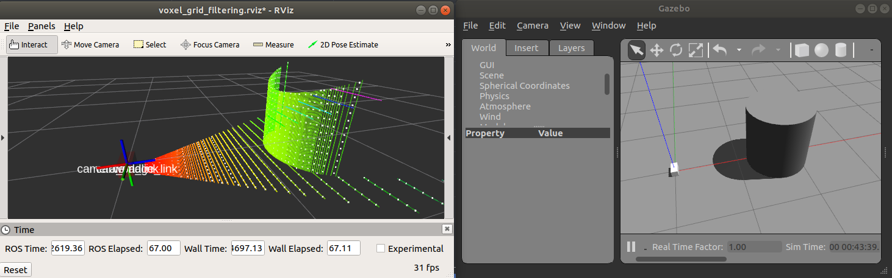

**voxel_grid_filtering.launch**

```xml
<launch>
  <node pkg="nodelet" type="nodelet" name="pcl_manager" args="manager" output="screen" />

  <!-- Run a VoxelGrid filter to clean NaNs and downsample the data -->
  <node pkg="nodelet" type="nodelet" name="voxel_grid" args="load pcl/VoxelGrid pcl_manager" output="screen">
    <remap from="~input" to="/camera/depth/points" />
    <rosparam>
      filter_field_name: z
      filter_limit_min: 0.01
      filter_limit_max: 1.5
      filter_limit_negative: False
      leaf_size: 0.03
    </rosparam>
  </node>
</launch>
```

**Running the example:**

```shell
# Terminal 1
roslaunch pcl_tester pcl_tester.launch

# Terminal 2
roslaunch pcl_tester voxel_grid_filtering.launch

# Then go into Gazebo and add or move obstacles around!
```


#### **Example: Floor Plane Segmentation**

If you can filter away the floor, you'll have a much easier time looking for and fitting models of non-floor objects for further processing and manipulation. 

> Notice that we can route the output of one nodelet into another nodelet's input.
>
> Eg: `voxel_grid/output` -> the other nodelets

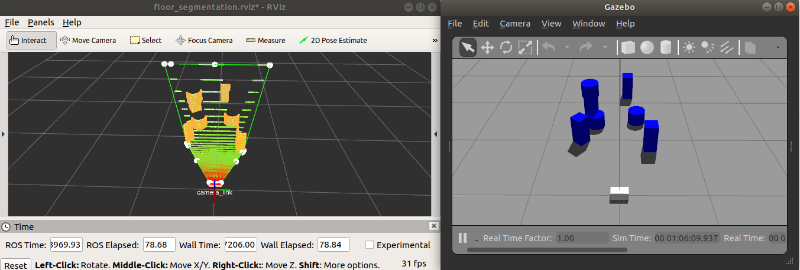

**Running the example:**

> Check the example launch file for the code!

```shell
# Terminal 1
roslaunch pcl_tester pcl_tester.launch

# Terminal 2
roslaunch pcl_tester floor_segmentation.launch

# Then go into Gazebo and add or move obstacles around!
```


#### **Example: Cylinder Segmentation**

We find cylinders, then we filter the found point clouds so we have nicely segmented cylinders!

Note that this particular segmentation algorithm selects a single cylinder, and only the best fit cylinder. If you want to find multiple cylinders, take the non-cylinder point clouds and re-run cylinder segmentation on them to find further cylinders, or implement a custom node/nodelet using the C++ API directly.

(Green is filtered, red is unfiltered.)

> Notice that we can route the output of one nodelet into another nodelet's input.
>
> Eg: `voxel_grid/output` -> the other nodelets

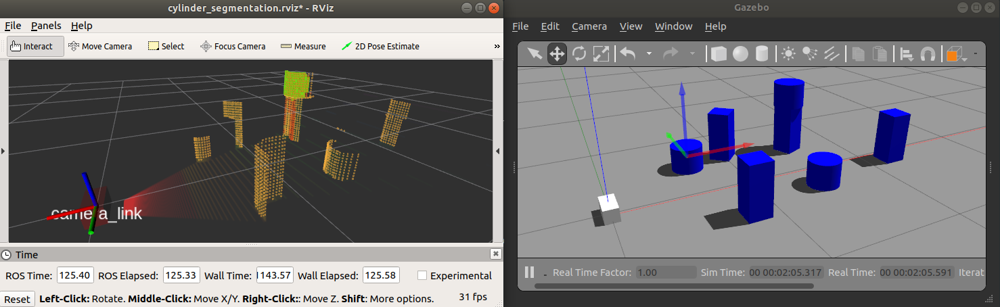

**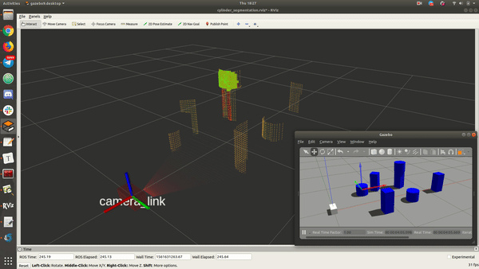**

**Running the example:**

> Check the example launch file for the code!

```shell
# Terminal 1
roslaunch pcl_tester pcl_tester.launch

# Terminal 2
roslaunch pcl_tester cylinder_segmentation.launch

# Then go into Gazebo and add or move obstacles around!
```


#### **Example: Euclidean Cluster Extraction**

Extracting clusters via euclidean distance!

> Notice that the output results in a flashing point cloud. This is actually because each successive message publishes the point cloud for all points in a single particular cluster. Then the nodelet iterates through all found clusters.
>
> You will have to find a way to demultiplex them yourself.
>
> Alternatively, you can write your own nodelet that publishes a message which contains an array of point clouds instead. The [original nodelet source file](<http://docs.ros.org/latest/api/pcl_ros/html/extract__clusters_8cpp_source.html>) can be a good start!

![[video-to-gif output image]](assets/ezgif-3-c5c78f8a46c5.gif)

**Running the example:**

> Check the example launch file for the code!

```shell
# Terminal 1
roslaunch pcl_tester pcl_tester.launch

# Terminal 2
roslaunch pcl_tester euclidean_cluster_extraction.launch

# Then go into Gazebo and add or move obstacles around!
```


### 3.5. Octomaps <a name="3.5"></a>
[go to top](#top)


[Octomap Package](<http://wiki.ros.org/octomap_server>)

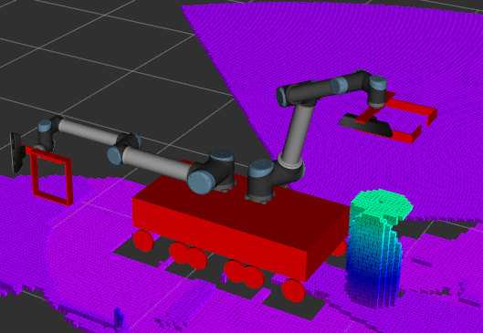

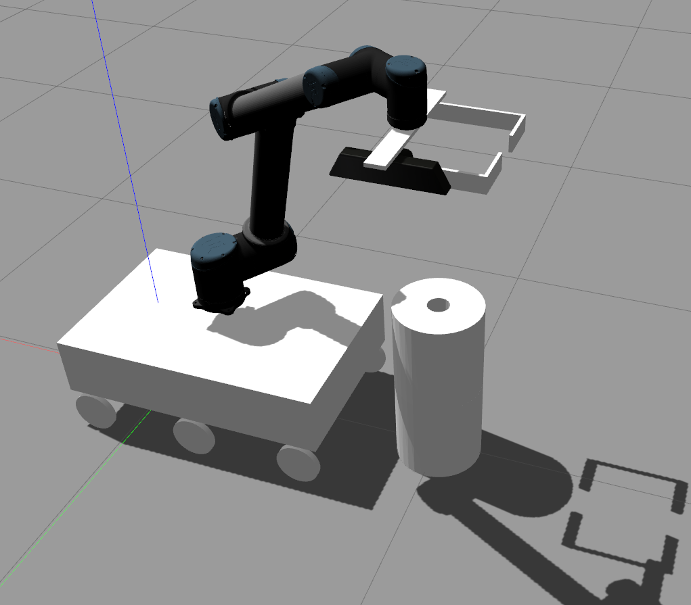

[Image Source](<http://answers.ros.org/question/290398/help-with-procedure-for-simple-pick-and-place-task-using-moveit/>)

Since MoveIt! has integration capabilities with Octomaps (octree based occupancy maps), and we're dealing with point clouds which is the input, I figured it would be a good idea to mention it briefly here.

**Install**

```shell
sudo apt install ros-$(ROS_DISTRO)-octomap
sudo apt install ros-$(ROS_DISTRO)-octomap-ros
sudo apt install ros-$(ROS_DISTRO)-octomap-server
```

**Launch**

```xml
<launch>
  <node pkg="octomap_server" type="octomap_server_node" name="octomap_server">
    <remap from="cloud_in" to="camera/depth/points" />
    <param name="resolution" value="0.025" />
    <param name="frame_id" type="string" value="camera_link" />
    <param name="sensor_model/max_range" value="5.0" />
  </node>
</launch>
```

**Using Octomaps**

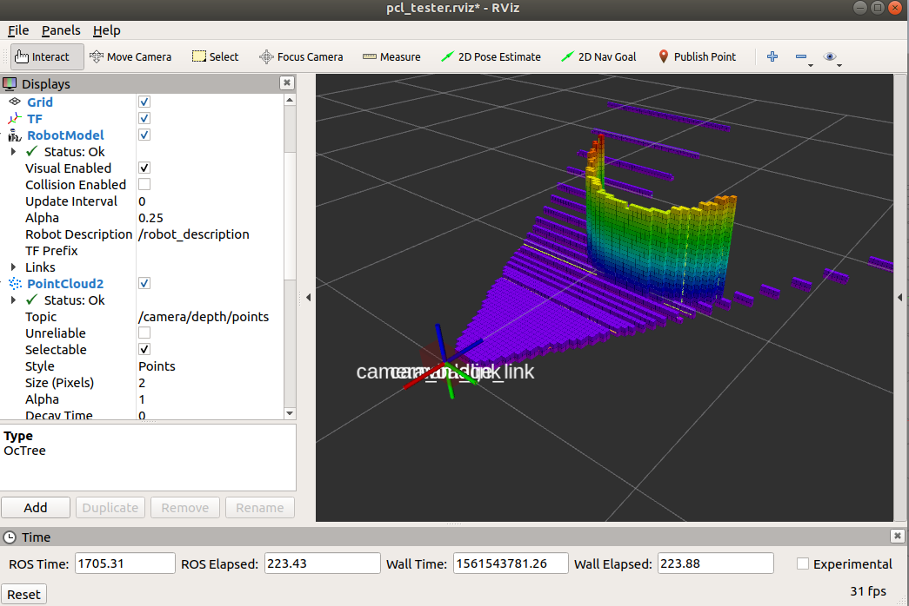

You need to use the RViz plugin to visualise octomaps. You can either install it with `sudo apt install` or build it from source (clone the [Github repository](<https://github.com/OctoMap/octomap_rviz_plugins>) and run `catkin_make` or `catkin build`)

For `sudo apt install`, run this command (Melodic and above potentially not released yet.)

```shell
sudo apt-get install ros-$(ROS_DISTRO)-octomap-rviz-plugins
```


Then, to integrate it with MoveIt!, follow this tutorial (since it's unrelated to PCL): <http://docs.ros.org/melodic/api/moveit_tutorials/html/doc/perception_pipeline/perception_pipeline_tutorial.html>

**Run The Example**

```shell
# Terminal 1
roslaunch pcl_tester pcl_tester.launch

# Terminal 2
roslaunch pcl_tester octomap.launch

# Then go into Gazebo and add or move obstacles around!
```


## 4. PCL C++ API <a name="4"></a>

Time to code!

### 4.1. Introduction <a name="4.1"></a>
[go to top](#top)


Since we'll be using PCL for ROS, not everything will be covered. Just enough to get you started.

Luckily there's a whole page full of [tutorials](<http://pointclouds.org/documentation/tutorials/matrix_transform.php#matrix-transform>). 


### 4.2. ROS Package Setup <a name="4.2"></a>
[go to top](#top)


A CMakeLists.txt file that looks like this should get you all set for generally any application you'll want to write.

> Do note that these are just examples and you're expected to configure them as you need!

```cmake
cmake_minimum_required(VERSION 2.8.3)
project(PACKAGE_NAME)

find_package(PCL REQUIRED) # This includes all modules
find_package(PkgConfig)
pkg_check_modules(EIGEN3 eigen3 REQUIRED)

find_package(catkin REQUIRED COMPONENTS
  roscpp std_msgs
  pcl_conversions pcl_ros
)

catkin_package(CATKIN_DEPENDS roscpp std_msgs pcl_conversions pcl_ros)

include_directories(${catkin_INCLUDE_DIRS})
include_directories(${PCL_INCLUDE_DIRS})
include_directories(${EIGEN3_INCLUDE_DIRS})
link_directories(${PCL_LIBRARY_DIRS})
add_definitions(${PCL_DEFINITIONS})

add_executable(YOUR_NODE_NAME src/YOUR_NODE.cpp)
target_link_libraries(YOUR_NODE_NAME ${catkin_LIBRARIES} ${PCL_LIBRARIES})
```

Same for this package.xml

```xml
<?xml version="1.0"?>
<package>
  <name>PACKAGE_NAME</name>
  <version>0.0.0</version>
  <description>RAWR</description>

  <maintainer email="methylDragon@gmail.com">methylDragon</maintainer>
  <license>RAWR</license>

  <buildtool_depend>catkin</buildtool_depend>

  <build_depend>roscpp</build_depend>
  <build_depend>std_msgs</build_depend>
  <build_depend>pcl_conversions</build_depend>
  <build_depend>pcl_ros</build_depend>

  <run_depend>roscpp</run_depend>
  <run_depend>std_msgs</run_depend>
  <run_depend>pcl_conversions</run_depend>
  <run_depend>pcl_ros</run_depend>
</package>
```

Remember that you can go ahead and use `catkin_make` or `catkin build` as you do with any general ROS package to build the package.


### 4.3. Basic Includes <a name="4.3"></a>
[go to top](#top)


These should get you started.

```c++
#include <pcl/point_cloud.h>
#include <pcl/point_types.h>
#include <ros/ros.h>
#include <sensor_msgs/PointCloud2.h>
#include <pcl_conversions/pcl_conversions.h>
```

For more advanced stuff, check out the API docs, or go back to this tutorial's introduction and check out the **library overview**.

Eg. To include the voxel_grid filter, use `#include <pcl/filters/voxel_grid.h>`


### 4.4. Point Clouds <a name="4.4"></a>
[go to top](#top)


The **pcl::PointCloud<>** type forms the core basic data structure for use with PCL. It's initialised with a stated [PointT](<http://pointclouds.org/documentation/tutorials/adding_custom_ptype.php>) struct type.

```c++
// Example with the pcl::PointXYZ point type
pcl::PointCloud<pcl::PointXYZ> cloud;
```

Point clouds can be n-dimensional, and have several special members, which mean different things depending on the type of point cloud the cloud is supposed to represent.

> ### Organised Point Cloud
>
> An **organized point cloud** dataset is the name given to point clouds that resemble an organized image (or matrix) like structure, where the data is split into rows and columns. Examples of such point clouds include data coming from stereo cameras or Time Of Flight cameras. The advantages of an organized dataset is that by knowing the relationship between adjacent points (e.g. pixels), nearest neighbor operations are much more efficient, thus speeding up the computation and lowering the costs of certain algorithms in PCL.
>
> ### Projectable Point Cloud
>
> An **projectable point cloud** dataset is the name given to point clouds that have a correlation according to a pinhole camera model between the (u,v) index of a point in the organized point cloud and the actual 3D values. This correlation can be expressed in it’s easiest form as: u = f*x/z and v = f*y/z
>
> <http://pointclouds.org/documentation/tutorials/basic_structures.php#id5>

Generally think of an organised point cloud like a N-D image (like 2D or 3D). Whereas unorganised point clouds are going to be 1D.

```c++
// Width : int
// Unorganised: Total number of elements in .points
// Organised: Width of each row
cloud.width;

// Height : int
// Unorganised: Is equal to 1 (one single row)
// Organised: Number of rows
cloud.height;

// Points : std::vector<PointT>
// The actual data array of each individual point of type PointT
cloud.points;

// is_dense : bool
// True if all points are finite, False if there can be inf/NaN values
cloud.is_dense;

// Sensor origin : Eigen::Vector4f
// Sensor pose (optional)
cloud.sensor_origin;

// Sensor orientation : Eigen::Quarternionf
// Sensor orientation (optional)
cloud.sensor_orientation;

// Check of cloud is organised
cloud.isOrganised();
```


### 4.5. Accessing Point Cloud Points <a name="4.5"></a>
[go to top](#top)


Since point clouds contain a `points` member which is actually just a std::vector of points, it's fairly simple to iterate through the vector and access each individual points' members.

#### **Iterating Through a Point Cloud**

You can use the standard C++ iteration syntax.

```c++
for (auto const point : cloud->points) // For each point in cloud->points
{
  .
  .
  .
}
```

#### **Accessing Point Members**

Since points are actually structs of their respective point types, you can access their members just as you would normal struct members.

```c++
point.x; // These point members are valid for points of the PointXYZ point type
point.y;
point.z;
```


### 4.6. Common Field Names <a name="4.6"></a>
[go to top](#top)


> Because field names are generic in the new [PointCloud2](http://wiki.ros.org/PointCloud2) message, here's the list of commonly used names within PCL:
>
> - *x* - the **X** Cartesian coordinate of a point (float32)
>
> - *y* - the **Y** Cartesian coordinate of a point (float32)
>
> - *z* - the **Z** Cartesian coordinate of a point (float32)
>
> - *rgb* - the RGB (24-bit packed) color at a point (uint32)
>
> - *rgba* - the A-RGB (32-bit packed) color at a point (uint32), the field name is unfortunately misleading
>
> - *normal_x* - the first component of the normal direction vector at a point (float32)
>
> - *normal_y* - the second component of the normal direction vector at a point (float32)
>
> - *normal_z* - the third component of the normal direction vector at a point (float32)
>
> - *curvature* - the surface curvature change estimate at a point (float32)
>
> - *j1* - the first moment invariant at a point (float32)
>
> - *j2* - the second moment invariant at a point (float32)
>
> - *j3* - the third moment invariant at a point (float32)
>
> - *boundary_point* - the boundary property of a point (e.g., set to 1 if the point is lying on a boundary) (bool)
>
> - *principal_curvature_x* - the first component of the direction of the principal curvature at a point (float32)
>
> - *principal_curvature_y* - the second component of the direction of the principal curvature at a point (float32)
>
> - *principal_curvature_z* - the third component of the direction of the principal curvature at a point (float32)
>
> - *pc1* - the magnitude of the first component of the principal curvature at a point (float32)
>
> - *pc2* - the magnitude of the second component of the principal curvature at a point (float32)
>
> - *pfh* - the Point Feature Histogram (PFH) feature signature at a point (float32[])
>
> - *fpfh* - the Fast Point Feature Histogram (FPFH) feature signature at a point (float32[])
>
>   ...
>
> The complete list of field names and point types used in PCL can be found in [pcl/point_types.hpp](http://docs.ros.org/hydro/api/pcl/html/point__types_8hpp.html).
>
> <http://wiki.ros.org/pcl/Overview#Subscribing_to_different_point_cloud_message_types>


### 4.7. PCL and ROS Point Cloud Conversions <a name="4.7"></a>
[go to top](#top)


#### **Introduction**

Like was stated in the introduction, there are two main data types that PCL and ROS will use. [**sensor_msgs::PointCloud2**](<http://docs.ros.org/melodic/api/sensor_msgs/html/msg/PointCloud2.html>), which is used by ROS and [**pcl::PointCloud**](http://docs.pointclouds.org/trunk/classpcl_1_1_point_cloud.html), which is used by PCL. And of course, **pcl::PCLPointCloud2**, which is supposed to be the new sensor_msgs::PointCloud2 meant just for PCL.

Naturally there has to be a way to convert between them.

Luckily there's these functionalities in the base library as well as in a module for it called **pcl_conversions**.

They support **copy** and **move** conversions. And of course, the **move** conversions are much faster but can't be used on const objects which are normally passed in from ROS message callbacks for speed (to prevent copy operations for the message.)

> The `pcl_conversions` package is specifically a ROS package, meant to serve as a conversion adapter for ROS to PCL and vice versa.

> I will also not include snippets for the `sensor_msgs::PointCloud` (which is different from `sensor_msgs::PointCloud2` datatype) since it's depreciated and will only really serve to confuse.


#### **ROS sensor_msgs::PointCloud2 <-> PCL pcl::PointCloud**

Suppose you have an incoming ROS message, let's perform conversions to and from the ROS message point cloud!

> Note that this method is slower than using the moveTo and moveFrom variants of the function. But we can't do that for the `fromROSmsg` method since the message was passed in as a const. Though we **can** do it for the `toROSMsg` since output isn't const.

> Also, these conversion methods are passed by reference.

> Also note that this method is slated for depreciation. PCL really does not like to natively support ROS.

```c++
void cloud_cb(const sensor_msgs::PointCloud2ConstPtr& input)
{
  // Generate container variables
  pcl::PointCloud<pcl::PointXYZ> cloud;
  sensor_msgs::PointCloud2 output;

  // Convert from ROS PointCloud2 to PCL Point Cloud
  pcl::fromROSMsg(*input, cloud);
    
  // Do some cool stuff here on cloud
    
  // Then convert from PCL Point Cloud back to ROS PointCloud2
  pcl::toROSMsg(cloud, output);

  pub.publish(output);
  return;
}
```


#### **ROS sensor_msgs::PointCloud2 <-> PCL PCLPointCloud2**

```c++
void cloud_cb(const sensor_msgs::PointCloud2ConstPtr& input)
{
  // Generate container variables
  pcl::PCLPointCloud2* cloud = new pcl::PCLPointCloud2; 
  pcl::PCLPointCloud2ConstPtr cloudPtr(cloud);
  pcl::PCLPointCloud2 cloud_filtered;

  // Convert from ROS PointCloud2 to PCL PointCloud2
  pcl_conversions::toPCL(*input, *cloud);

  // Do some cool stuff here that assigns to cloud_filtered
  // Like... a voxel filter!
  pcl::VoxelGrid<pcl::PCLPointCloud2> sor;
  sor.setInputCloud (cloudPtr);
  sor.setLeafSize (0.1, 0.1, 0.1);
  sor.filter (cloud_filtered);
    
  // Then convert from PCL Pointcloud2 back to ROS PointCloud2 
  sensor_msgs::PointCloud2 output;
  pcl_conversions::fromPCL(cloud_filtered, output);

  // Publish the data
  pub.publish(output);
  return;
}
```


#### **A Simpler Way**

Actually those above two conversion methods were included for completeness' sake. If you just use pcl::PointCloud2 directly and assume that it is a valid ROS type, there's an underlying templating mechanism that results in `pcl::PointCloud2` and `sensor_msgs::PointCloud2` messages being **automagically** serialised into the correct type.

**This greatly simplifies everything!**

> For more info: <http://wiki.ros.org/pcl/Overview#Subscribing_to_different_point_cloud_message_types>

```c++
void cloud_cb (const pcl::PCLPointCloud2ConstPtr& cloud)
{
  pcl::PCLPointCloud2 output;

  // Create filter
  pcl::PassThrough<pcl::PCLPointCloud2> pass;
  pass.setInputCloud (cloud);
  pass.setFilterFieldName ("z");
  pass.setFilterLimits (0.0, 1.0);
  pass.filter (output);

  // Publish the data
  pub.publish (output);
}

int main (int argc, char** argv)
{
  // Initialize ROS
  ros::init (argc, argv, "auto_serialise_test_node");
  ros::NodeHandle nh;

  // Create a ROS subscriber for the input point cloud
  ros::Subscriber sub = nh.subscribe("input", 1, cloud_cb);

  // Create a ROS publisher for the output point cloud
  pub = nh.advertise<pcl::PCLPointCloud2> ("output", 1);

  // Spin
  ros::spin ();
}
```

**Test it out!**

```shell
# Terminal 1
$ roslaunch pcl_tester pcl_tester.launch

# Terminal 2
$ rosrun pcl_tester minimal_pub_sub
```


#### **Move and Copy**

Most if not all the conversion methods actually include **move** and **copy** variants.

Just prepend the method name with move or copy.

Eg. `moveFromROS`.

Move is more efficient than Copy, but can't be done for const objects. Also, if you Move, it just changes the pointer reference, so any changes to the data inside will change the data in every location that pointer dereferences to.


#### **pcl_conversions Reference**

For more info, check out the [class reference for pcl_conversions](<https://docs.ros.org/api/pcl_conversions/html/pcl__conversions_8h.html>)


### 4.8. File IO <a name="4.8"></a>
[go to top](#top)


#### **Setup**

Include these headers

```c++
#include <pcl/io/pcd_io.h>
#include <pcl/point_types.h>
```

We'll be working with the .pcd filetype, which is the canonical filetype for working with PCL. You can use the PCL tools stated further up in this tutorial to convert different filetypes to the .pcd type.

We'll just work through the basics here, but for more info, do check out the [class reference for pcl io](<http://docs.pointclouds.org/trunk/group__io.html>)


#### **The .pcd Filetype**

Source: <http://pointclouds.org/documentation/tutorials/pcd_file_format.php#pcd-file-format>

> The PCD file format is not meant to reinvent the wheel, but rather to complement existing file formats that for one reason or another did not/do not support some of the extensions that PCL brings to n-D point cloud processing.
>
> PCD is not the first file type to support 3D point cloud data. The computer graphics and computational geometry communities in particular, have created numerous formats to describe arbitrary polygons and point clouds acquired using laser scanners. Some of these formats include:
>
> - [PLY](http://en.wikipedia.org/wiki/PLY_(file_format)) - a polygon file format, developed at Stanford University by Turk et al
> - [STL](http://en.wikipedia.org/wiki/STL_(file_format)) - a file format native to the stereolithography CAD software created by 3D Systems
> - [OBJ](http://en.wikipedia.org/wiki/Wavefront_.obj_file) - a geometry definition file format first developed by Wavefront Technologies
> - [X3D](http://en.wikipedia.org/wiki/X3D) - the ISO standard XML-based file format for representing 3D computer graphics data
> - [and many others](http://en.wikipedia.org/wiki/Category:Graphics_file_formats)
>
> All the above file formats suffer from several shortcomings, as explained in the next sections – which is natural, as they were created for a different purpose and at different times, before today’s sensing technologies and algorithms had been invented.

**File Headers**

| Entry     | Description                                                  |
| --------- | ------------------------------------------------------------ |
| Version   | PCD file version                                             |
| Fields    | Name of each dimension/field (eg. FIELDS x y z)              |
| Size      | Byte size of each dimension entry                            |
| Type      | Type of each dimension as a char (I for signed int typess, U for unsigned, F for float) |
| Count     | Number of elements each dimension per point has              |
| Width     | Width of the point cloud if organised, total number of points for unorganised |
| Height    | Height of the point cloud organised, 1 if unorganised        |
| Viewpoint | Pose of the viewpoint (x, y, z, ori_w, ori_x, ori_y, ori_z)  |
| Points    | Total number of points in cloud                              |
| Data      | Data type that the point cloud data is stored in (binary or ascii) |

Write them like this, **IN THIS ORDER ONLY**

```
VERSION
FIELDS
SIZE
TYPE
COUNT
WIDTH
HEIGHT
VIEWPOINT
POINTS
DATA
```

After that you can then add in your fields.

If field type is **ascii**, each data point is on a new line. Eg.

```
# .PCD v.7 - Point Cloud Data file format
VERSION .7
FIELDS x y z rgb
SIZE 4 4 4 4
TYPE F F F F
COUNT 1 1 1 1
WIDTH 213
HEIGHT 1
VIEWPOINT 0 0 0 1 0 0 0
POINTS 213
DATA ascii
0.93773 0.33763 0 4.2108e+06
0.90805 0.35641 0 4.2108e+06
0.81915 0.32 0 4.2108e+06
0.97192 0.278 0 4.2108e+06
0.944 0.29474 0 4.2108e+06
0.98111 0.24247 0 4.2108e+06
```

Whereas binary is just binary dump data.


#### **Reading .pcd Files**

Source: <http://pointclouds.org/documentation/tutorials/reading_pcd.php>

```c++
// Allocate new memory to the free store
pcl::PointCloud<pcl::PointXYZ>::Ptr cloud (new pcl::PointCloud<pcl::PointXYZ>);

// Load file and check if the file loaded
if (pcl::io::loadPCDFile<pcl::PointXYZ> ("test_pcd.pcd", *cloud) == -1)
{
  PCL_ERROR ("Couldn't read file test_pcd.pcd \n");
  return (-1);
}

// Access data members
cloud->width;
cloud->height;

// Iterate through cloud
for (size_t i = 0; i < cloud->points.size (); ++i)
{
  cloud->points[i].x;
  cloud->points[i].y;
  cloud->points[i].z;
}

return (0);
```


#### **Writing .pcd Files**

Source: <http://pointclouds.org/documentation/tutorials/writing_pcd.php#writing-pcd>

```c++
pcl::PointCloud<pcl::PointXYZ> cloud;

// Fill in the cloud data
cloud.width    = 5;
cloud.height   = 1;
cloud.is_dense = false;
cloud.points.resize (cloud.width * cloud.height);

// Iterate through the cloud and fill it with random data
for (size_t i = 0; i < cloud.points.size (); ++i)
{
    cloud.points[i].x = 1024 * rand () / (RAND_MAX + 1.0f);
    cloud.points[i].y = 1024 * rand () / (RAND_MAX + 1.0f);
    cloud.points[i].z = 1024 * rand () / (RAND_MAX + 1.0f);
}

// Save the file!
pcl::io::savePCDFileASCII ("test_pcd.pcd", cloud);
```


### 4.9. Cloud Concatenation <a name="4.9"></a>
[go to top](#top)


```c++
// Concatenate the points of each cloud
cloud_c  = cloud_a;
cloud_c += cloud_b;

// Concatenate the fields of each cloud
pcl::concatenateFields (cloud_a, cloud_b, output);
```


### 4.10. Filters <a name="4.10"></a>
[go to top](#top)


#### **Setup**

```c++
// Ensure that you include the correct filter you want to use!
#include <pcl/filters/passthrough.h> // Eg. PassThrough filter
```


#### **Introduction**

All PCL filters (and features and segmentation pipelines) actually use the same basic usage interface!

- Call `setInputCloud` to set the input
- Set some parameters by calling the relevant class methods
- Call a compute method to get the output


#### **Example PassThrough Filter**

Put this into a ROS node!

```c++
#include <pcl/filters/passthrough.h>

void cloud_cb (const pcl::PCLPointCloud2ConstPtr& cloud)
{
  pcl::PCLPointCloud2 output;

  // Create filter
  pcl::PassThrough<pcl::PCLPointCloud2> pass;
  pass.setInputCloud (cloud);
  pass.setFilterFieldName ("z");
  pass.setFilterLimits (0.0, 1.0);

  // Fit filtered data to output
  pass.filter (output);

  // Publish the data
  pub.publish (output);
}
```


#### **More Filters**

<http://docs.pointclouds.org/1.7.0/group__filters.html>


### 4.11. Visualisation <a name="4.11"></a>
[go to top](#top)


There's a lot more configuration options than what I'll go through here, but for the full suite, check out [(the tutorial for PCLVisualizer](<http://pointclouds.org/documentation/tutorials/pcl_visualizer.php#pcl-visualizer>).

**Visualise a Single Point Cloud**

```c++
// Init Viewer Object
pcl::visualization::PCLVisualizer::Ptr viewer (new pcl::visualization::PCLVisualizer ("3D Viewer"));viewer->setBackgroundColor (0, 0, 0);

// Add Point Cloud
viewer->addPointCloud<pcl::PointXYZ> (cloud, "sample cloud");

// Config Viewer
viewer->setPointCloudRenderingProperties (pcl::visualization::PCL_VISUALIZER_POINT_SIZE, 1, "sample cloud");
viewer->addCoordinateSystem (1.0);
viewer->initCameraParameters ();

// Spin Viewer
while (!viewer->wasStopped ())
{
  viewer->spinOnce (100);
  boost::this_thread::sleep (boost::posix_time::microseconds (100000));
}

```


## 5. Putting It Together: Cylinder Segmentation Example Integration with MoveIt! <a name="5"></a>

We'll do a walk through of this [code snippet](<https://github.com/ros-planning/moveit_tutorials/blob/kinetic-devel/doc/perception_pipeline/src/cylinder_segment.cpp>) from the [MoveIt! Perception Pipeline tutorial](<http://docs.ros.org/kinetic/api/moveit_tutorials/html/doc/perception_pipeline/perception_pipeline_tutorial.html#detecting-and-adding-object-as-collision-object>).

Some of the more verbose comments have been shortened for brevity.

You might have to change some of the configuration parameters to make things work. I recommend using rqt_reconfigure with the individual components' ROS nodelets first to tune them first. Then after that you can use those parameters and bake them into the code directly. (Or better yet, eventually do a .yaml file and parse the configurations directly from the ROS parameter server. But that's out the scope of this tutorial.)

Original code Source (though I modified it a bit): <https://github.com/ros-planning/moveit_tutorials/blob/kinetic-devel/doc/perception_pipeline/src/cylinder_segment.cpp>

> Code modifications:
>
> - Removal of raw pointers
> - Addition of additional filters
> - Tuning of some parameters (though you'll have to tune them yourself eventually)

Unfortunately running this tutorial will require some MoveIt! experience. So I will not be putting the code up in a package for demoing.

Here's a gif of it working though! When the cylinder is flat the plane segmentation causes some small issues. (The GIF has been sped up to 150% of original speed.)

![[speed output image]](assets/ezgif-3-3d54ed7f7dd4.gif)


### 5.1. Includes and Definitions <a name="5.1"></a>
[go to top](#top)


```c++
#include <ros/ros.h>
#include <sensor_msgs/PointCloud2.h>
#include <pcl_conversions/pcl_conversions.h>
#include <pcl/filters/passthrough.h>
#include <pcl/filters/extract_indices.h>
#include <pcl/filters/statistical_outlier_removal.h>
#include <pcl/features/normal_3d.h>
#include <pcl/segmentation/sac_segmentation.h>

#include <moveit/planning_scene_interface/planning_scene_interface.h>
#include <moveit_msgs/CollisionObject.h>

// Then we'll define a helper struct and a config variable

std::string CYLINDER_NAME = "cylinder";

struct AddCylinderParams
{
  /* Radius of the cylinder. */
  double radius;
  /* Direction vector towards the z-axis of the cylinder. */
  double direction_vec[3];
  /* Center point of the cylinder. */
  double center_pt[3];
  /* Height of the cylinder. */
  double height;
};
```


### 5.2. Class Definition <a name="5.2"></a>
[go to top](#top)


We'll write a class for neatness' sake and for easy passing of a cloud pointer around

```c++
class CylinderSegment
{
public:
  // Constructor
  CylinderSegment()
  {
    sub = nh.subscribe("/camera/depth/points", 1, &CylinderSegment::cloudCB, this);
    cloud_pub = nh.advertise<sensor_msgs::PointCloud2>("found_cylinder", 10);

    ros::Rate r(25);

    while (ros::ok())
    {
      ros::spinOnce();
      r.sleep();
    }
  }
```


### 5.3. Private and Protected Members <a name="5.3"></a>

[go to top](#top)

```c++
protected:
  ros::NodeHandle nh;
  ros::Publisher cloud_pub;
  ros::Subscriber sub;
};
```


### 5.4. Class Methods <a name="5.4"></a>
[go to top](#top)

All the following class methods are written within the CylinderSegment class definition

#### **Remove a Cylinder from the MoveIt! Planning Scene**

```c++
public:
  void removeCylinder(moveit::planning_interface::PlanningSceneInterface& planning_scene_interface)
  {
    std::vector<std::string> object_ids;
    object_ids.push_back("cylinder");

    planning_scene_interface.removeCollisionObjects(object_ids);
  }
```


#### **Add a Cylinder to the MoveIt! Planning Scene**
```c++
  void addCylinder(moveit::planning_interface::PlanningSceneInterface& planning_scene_interface, AddCylinderParams& cylinder_params)
  {
    // ROS Collision Object Message
    moveit_msgs::CollisionObject collision_object;
    collision_object.header.frame_id = "pcl_camera_image_link";
    collision_object.id = CYLINDER_NAME;

    // Create the Cylinder
    shape_msgs::SolidPrimitive primitive;
    primitive.type = primitive.CYLINDER;
    primitive.dimensions.resize(2);
    primitive.dimensions[0] = cylinder_params.height;
    primitive.dimensions[1] = cylinder_params.radius;

    // Create the Cylinder's Pose
    geometry_msgs::Pose cylinder_pose;
    Eigen::Vector3d cylinder_z_direction(cylinder_params.direction_vec[0],
                                         cylinder_params.direction_vec[1],
                                         cylinder_params.direction_vec[2]);
    Eigen::Vector3d origin_z_direction(0., 0., 1.);
    Eigen::Vector3d axis;
    axis = origin_z_direction.cross(cylinder_z_direction);
    axis.normalize();
    double angle = acos(cylinder_z_direction.dot(origin_z_direction));
    cylinder_pose.orientation.x = axis.x() * sin(angle / 2);
    cylinder_pose.orientation.y = axis.y() * sin(angle / 2);
    cylinder_pose.orientation.z = axis.z() * sin(angle / 2);
    cylinder_pose.orientation.w = cos(angle / 2);

    // Set the position of the cylinder
    cylinder_pose.position.x = cylinder_params.center_pt[0];
    cylinder_pose.position.y = cylinder_params.center_pt[1];
    cylinder_pose.position.z = cylinder_params.center_pt[2];

    // Add cylinder as collision object
    collision_object.primitives.push_back(primitive);
    collision_object.primitive_poses.push_back(cylinder_pose);
    collision_object.operation = collision_object.ADD;
    planning_scene_interface.applyCollisionObject(collision_object);
  }
```


#### **Grab Cylinder Centre Coordinates and Height**

```c++
  void extractLocationHeight(pcl::PointCloud<pcl::PointXYZRGB>::Ptr cloud, AddCylinderParams& cylinder_params)
  {
    // Init min and max angle recorders
    double max_angle_y = 0.0;
    double min_angle_y = std::numeric_limits<double>::infinity();

    double lowest_point[3];
    double highest_point[3];

    // Loop over the entire pointcloud
    for (auto const point : cloud->points)
    {
      /* Find the coordinates of the highest point (vertically) */
      if (atan2(point.z, point.y) < min_angle_y)
      {
        min_angle_y = atan2(point.z, point.y);
        lowest_point[0] = point.x;
        lowest_point[1] = point.y;
        lowest_point[2] = point.z;
      }
      /* Find the coordinates of the lowest point (vertically) */
      else if (atan2(point.z, point.y) > max_angle_y)
      {
        max_angle_y = atan2(point.z, point.y);
        highest_point[0] = point.x;
        highest_point[1] = point.y;
        highest_point[2] = point.z;
      }
    }

    /* Store the center point of cylinder */
    cylinder_params.center_pt[0] = (highest_point[0] + lowest_point[0]) / 2;
    cylinder_params.center_pt[1] = (highest_point[1] + lowest_point[1]) / 2;
    cylinder_params.center_pt[2] = (highest_point[2] + lowest_point[2]) / 2;

    /* Store the height of cylinder */
    cylinder_params.height =
        sqrt(pow((lowest_point[0] - highest_point[0]), 2) + pow((lowest_point[1] - highest_point[1]), 2) +
             pow((lowest_point[2] - highest_point[2]), 2));
  }
```


#### **PassThrough FIlter**

```c++
  void passThroughFilter(pcl::PointCloud<pcl::PointXYZRGB>::Ptr cloud)
  {
    pcl::PassThrough<pcl::PointXYZRGB> pass;
    pass.setInputCloud(cloud);
    pass.setFilterFieldName("z");
    pass.setFilterLimits(0.26, 1.5);
    pass.filter(*cloud);
  }
```


#### **Normal Estimation**

```c++
  void computeNormals(pcl::PointCloud<pcl::PointXYZRGB>::Ptr cloud, pcl::PointCloud<pcl::Normal>::Ptr cloud_normals)
  {
    pcl::search::KdTree<pcl::PointXYZRGB>::Ptr tree(new pcl::search::KdTree<pcl::PointXYZRGB>());
    pcl::NormalEstimation<pcl::PointXYZRGB, pcl::Normal> ne;
    ne.setSearchMethod(tree);
    ne.setInputCloud(cloud);
    // Set the number of k nearest neighbors to use for the feature estimation.
    ne.setKSearch(25);
    ne.compute(*cloud_normals);
  }

  // Extract normals by index
  void extractNormals(pcl::PointCloud<pcl::Normal>::Ptr cloud_normals, pcl::PointIndices::Ptr inliers_plane)
  {
    pcl::ExtractIndices<pcl::Normal> extract_normals;
    extract_normals.setNegative(true);
    extract_normals.setInputCloud(cloud_normals);
    extract_normals.setIndices(inliers_plane);
    extract_normals.filter(*cloud_normals);
  }
```


#### **Planar Surface Removal**

```c++
  void removePlaneSurface(pcl::PointCloud<pcl::PointXYZRGB>::Ptr cloud, pcl::PointCloud<pcl::Normal>::Ptr cloud_normals, pcl::PointIndices::Ptr inliers_plane)
  {
    // Find Plane
    pcl::SACSegmentationFromNormals<pcl::PointXYZRGB, pcl::Normal> segmentor;
    segmentor.setOptimizeCoefficients(true);
    segmentor.setModelType(pcl::SACMODEL_NORMAL_PLANE);
    segmentor.setMethodType(pcl::SAC_RANSAC);

    Eigen::Vector3f axis = Eigen::Vector3f(0.0,0.0,1.0);
    segmentor.setAxis(axis);
    segmentor.setMaxIterations(1000);
    segmentor.setDistanceThreshold(0.155);
    segmentor.setEpsAngle(0.09);
    segmentor.setNormalDistanceWeight(0.1);
    segmentor.setInputCloud(cloud);
    segmentor.setInputNormals(cloud_normals);

    // Output plane
    pcl::ModelCoefficients::Ptr coefficients_plane(new pcl::ModelCoefficients);
    segmentor.segment(*inliers_plane, *coefficients_plane);

    /* Extract the planar inliers from the input cloud */
    pcl::ExtractIndices<pcl::PointXYZRGB> extract_indices;
    extract_indices.setInputCloud(cloud);
    extract_indices.setIndices(inliers_plane);

    /* Remove the planar inliers, extract the rest */
    extract_indices.setNegative(true);
    extract_indices.filter(*cloud);
  }
```


#### **Cylinder Segmentation**

```c++
  void extractCylinder(pcl::PointCloud<pcl::PointXYZRGB>::Ptr cloud, pcl::ModelCoefficients::Ptr coefficients_cylinder,
                       pcl::PointCloud<pcl::Normal>::Ptr cloud_normals)
  {
    // Create the segmentation object for cylinder segmentation and set all the parameters
    pcl::SACSegmentationFromNormals<pcl::PointXYZRGB, pcl::Normal> segmentor;
    pcl::PointIndices::Ptr inliers_cylinder(new pcl::PointIndices);
    segmentor.setOptimizeCoefficients(true);
    segmentor.setModelType(pcl::SACMODEL_CYLINDER);
    segmentor.setMethodType(pcl::SAC_RANSAC);
    // Set the normal angular distance weight
    segmentor.setNormalDistanceWeight(0.1);
    // run at max 1000 iterations before giving up
    segmentor.setMaxIterations(10000);
    // tolerance for variation from model
    segmentor.setDistanceThreshold(0.025);
    // min max values of radius in meters to consider
    segmentor.setRadiusLimits(0.01, 0.05);
    segmentor.setInputCloud(cloud);
    segmentor.setInputNormals(cloud_normals);

    // Obtain the cylinder inliers and coefficients
    segmentor.segment(*inliers_cylinder, *coefficients_cylinder);

    // Extract the cylinder inliers from the input cloud
    pcl::ExtractIndices<pcl::PointXYZRGB> extract;
    extract.setInputCloud(cloud);
    extract.setIndices(inliers_cylinder);
    extract.setNegative(false);
    extract.filter(*cloud);
  }
```


#### **Outlier Removal**

```c++
  void removeOutliers(pcl::PointCloud<pcl::PointXYZRGB>::Ptr cloud)
  {
    // Create the segmentation object for cylinder segmentation and set all the parameters
    pcl::StatisticalOutlierRemoval<pcl::PointXYZRGB> outlier_filter;

    outlier_filter.setInputCloud(cloud);
    outlier_filter.setMeanK(10);
    outlier_filter.setStddevMulThresh(2.5);
    outlier_filter.filter(*cloud);
  }
```


#### **ROS Cloud Callback Function**

```c++
  void cloudCB(const sensor_msgs::PointCloud2ConstPtr& input)
  {
    moveit::planning_interface::PlanningSceneInterface planning_scene_interface;

    // Create Param Struct Variable
    AddCylinderParams cylinder_params;

    pcl::PointCloud<pcl::PointXYZRGB>::Ptr cloud(new pcl::PointCloud<pcl::PointXYZRGB>);
    pcl::fromROSMsg(*input, *cloud);

    // Run Pass Through Filter
    passThroughFilter(cloud);

    // Find Normals
    pcl::PointCloud<pcl::Normal>::Ptr cloud_normals(new pcl::PointCloud<pcl::Normal>);
    computeNormals(cloud, cloud_normals);

    pcl::PointIndices::Ptr inliers_plane(new pcl::PointIndices);

    // Remove Plane Surface
    removePlaneSurface(cloud, cloud_normals, inliers_plane);

    // Grab normals of non-plane points
    extractNormals(cloud_normals, inliers_plane);

    // Grab Cylinder
    pcl::ModelCoefficients::Ptr coefficients_cylinder(new pcl::ModelCoefficients);
    extractCylinder(cloud, coefficients_cylinder, cloud_normals);

    // Remove Outliers
    removeOutliers(cloud);

    // Return error and remove planning scene cylinder if no cylinder found
    // else process the found cylinder cloud
    if (cloud->points.empty())
    {
      ROS_ERROR_STREAM_NAMED("cylinder_segment", "Can't find the cylinder!");
      removeCylinder(planning_scene_interface);
      return;
    }
    else
    {
      sensor_msgs::PointCloud2 cloud_msg;
      pcl::toROSMsg(*cloud, cloud_msg);

      cloud_pub.publish(cloud_msg);

      // Grab the cylinder parameters
      cylinder_params.radius = coefficients_cylinder->values[6];

      /* Store direction vector of z-axis of cylinder. */
      cylinder_params.direction_vec[0] = coefficients_cylinder->values[3];
      cylinder_params.direction_vec[1] = coefficients_cylinder->values[4];
      cylinder_params.direction_vec[2] = coefficients_cylinder->values[5];

      // Grab Cylinder Centre and Height
      extractLocationHeight(cloud, cylinder_params);

      ROS_INFO("Found cylinder!");

      // Add Cylinder to Planning Scene
      addCylinder(planning_scene_interface, cylinder_params);
    }
  }
```


### 5.5. Main Function <a name="5.5"></a>
[go to top](#top)


```c++
int main(int argc, char** argv)
{
  // Initialize ROS
  ros::init(argc, argv, "cylinder_segment");
  // Start the segmentor
  CylinderSegment();
}
```


```
                            .     .
                         .  |\-^-/|  .    
                        /| } O.=.O { |\
```

​    

------

[.png)](https://www.buymeacoffee.com/methylDragon)
